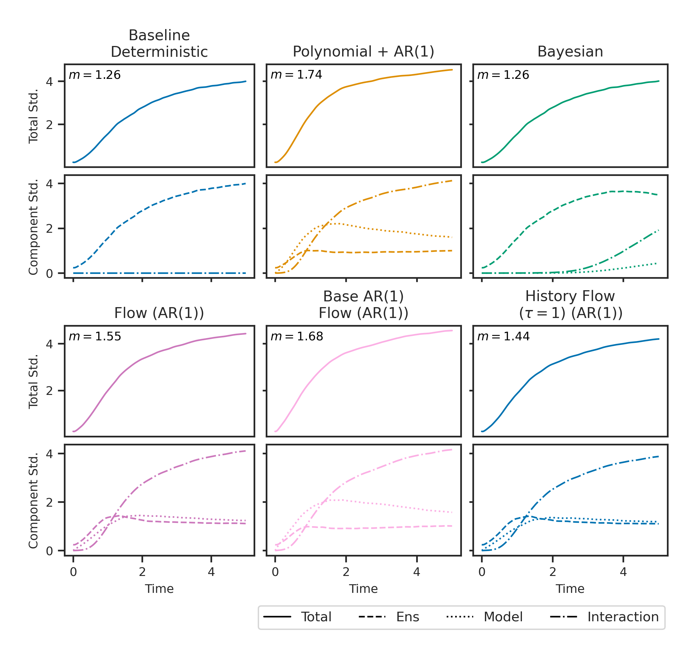

# Decomposing Ensemble Spread in Lorenz '96 with Learned Stochastic Parameterizations

This repository contains the source code for the paper [*Decomposing Ensemble Spread in Lorenz '96 with Learned Stochastic Parameterizations*](https://arxiv.org/abs/2605.22242) by Birgit Kühbacher, Daan Crommelin, and Niki Kilbertus.  

[](https://doi.org/10.5281/zenodo.20931977)

Weather and climate forecasts are inherently uncertain because of chaotic dynamics, imperfect initial conditions, and incomplete representations of the underlying physical processes. Operational ensembles aim to represent these uncertainties through forecast spread, yet many approaches are underdispersive: their spread grows too slowly relative to forecast error.

Using the two-scale Lorenz '96 (L96) system as a controlled testbed, we disentangle internal variability, initial-condition uncertainty, and stochastic model uncertainty. We compare deterministic, autoregressive, Bayesian, and flow-based parameterizations. Our results show that ensemble perturbations do not increase the system's long-term variance; instead, they regulate how rapidly trajectories decorrelate and explore the invariant measure. Stochastic parameterizations, particularly those with temporally persistent structure, enhance early spread growth and improve spread–error consistency.

<p align="center">
  
</p>


## Repository structure

- `src/models/`: two-scale Lorenz '96 and coarse-grained model implementations
- `src/parameterization/`: deterministic, autoregressive, Bayesian, and normalizing-flow parameterizations
- `src/ensemble/`: ensemble simulation routines
- `src/run/`: command-line entry points for data generation, training, and simulation
- `configs/`: YAML configuration files for the experiments
- `notebooks/evaluation/`: evaluation scripts and notebooks used to compute diagnostics and produce figures
- `tests/`: tests  


**Additional functionality not used in the paper:**

- A forcing-conditioned flow variant (`configs/fit_params_forcing_flow.yaml` and `configs/forcing_flow/`) and time-varying linear and oscillating forcing schedules.
- Initial-state generation through multiple independent spin-ups. The paper instead selects initial states at regular intervals from a single long trajectory.
- A Wilks-style[^1] perturbation scheme that adds anisotropic Gaussian noise using a covariance estimated from local analogues of each initial state. This method is computationally expensive and did not produce materially different results from the IID Gaussian perturbations used in the paper.

## Installation

Create the Conda environment and install the project in editable mode:

```bash
conda env create -f environment.yaml
conda activate uncertainty_env
python -m pip install -e .
```

All commands below assume they are run from the repository root with this environment active. Outputs are written below `results/` by default. The full experiments are computationally intensive; reduce `total_time`, ensemble sizes, or training epochs in the YAML files for a local smoke test.

## Reproducing the experiments

The experiments follow a common pipeline: generate L96 data, fit every parameterization, generate the initial conditions, and then run the same set of ensemble configurations for each reduced model. Run all commands from the repository root. The configuration files specify the corresponding input and output directories under `results/`.

### 1. Generate training data

Generate the long two-scale L96 trajectory used to fit all parameterizations:

```bash
python -m submit_local_run --config configs/generate_l96_training_data.yaml
```

### 2. Fit the parameterizations

Fit the polynomial baseline, polynomial+AR(1) model, Bayesian polynomial model, and all four flow variants:

```bash
python -m submit_local_run --config configs/fit_params_baseline.yaml
python -m submit_local_run --config configs/fit_params_bayes.yaml
python -m submit_local_run --config configs/fit_params_flow.yaml
python -m submit_local_run --config configs/fit_params_ar_base_flow.yaml
python -m submit_local_run --config configs/fit_params_history_flow.yaml
python -m submit_local_run --config configs/fit_params_tail_flow.yaml
```

The polynomial baseline and polynomial+AR(1) model are specified in `fit_params_baseline.yaml`. PyMC sampling for the Bayesian polynomial model can be slow and memory-intensive. The flow configurations use CUDA by default; set `device: cpu` in the corresponding training configurations when running without a GPU.


### 3. Generate and perturb initial conditions

Generate the well-separated initial states and their perturbed ensemble members:

```bash
python -m submit_local_run --config configs/generate_initial_states.yaml
python -m submit_local_run --config configs/perturb_initial_states.yaml
```

**Optional**: Run the first part of [`compute_sigma_clim.ipynb`](notebooks/evaluation/compute_sigma_clim.ipynb) to compute $\sigma_{\mathrm{clim}}$ for the long training trajectory in order to compute the perturbation magnitude. 
The currently specficied value of 0.25 is only valied for the specific L96 configuration. 

### 4. Run the coarse-grained model ensembles

Every parameterization is evaluated using the same four experiment types:

| Experiment | Initial conditions | Ensemble structure | Purpose |
| --- | --- | --- | --- |
| `long` | Unperturbed | 10 single-member trajectories of 10,000 model time units (MTU) | Estimates the stationary probability density, climatological standard deviation $\sigma_{\mathrm{clim}}$, and long-term temporal correlations. |
| `perfect` | Unperturbed | One 10-MTU trajectory from each of 300 initial states | Quantifies variability across trajectories when no initial-condition perturbations are added. Here, *perfect* refers to exact initial conditions, not to a perfect coarse-grained model. |
| `full` | Perturbed | $(N_{\mathrm{init}} \times N_{\mathrm{ens}} \times N_{\mathrm{model}})$ trajectories over 10 MTU | Crosses every initial-condition perturbation with every stochastic-parameterization realization. This separated structure supports uncertainty decomposition and forecast-skill evaluation. |
| `mix` | Perturbed | $(N_{\mathrm{init}} \times N_{\mathrm{ens}})$ trajectories over 10 MTU, with each member jointly sampling an initial-condition perturbation and a stochastic-parameterization realization | Represents the combined uncertainties in the form of a conventional operational ensemble. Comparing it with `full` verifies that the forecast-skill results are not an artifact of the separated ensemble construction. |

The configuration files follow the naming convention

```text
configs/<parameterization>/ensemble_gcm_<parameterization>_<experiment>.yaml
```

where `<experiment>` is `long`, `perfect`, `full`, or `mix`. The available parameterization directories are:

- `baseline_det`
- `baseline_ar1`
- `bayes`
- `flow`
- `ar_base_flow`
- `history_flow`
- `tail_flow`

For example, run all four experiments for the standard flow with:

```bash
python -m submit_local_run --config configs/flow/ensemble_gcm_flow_long.yaml
python -m submit_local_run --config configs/flow/ensemble_gcm_flow_perfect.yaml
python -m submit_local_run --config configs/flow/ensemble_gcm_flow_full.yaml
python -m submit_local_run --config configs/flow/ensemble_gcm_flow_mix.yaml
```

Apply this four-experiment pattern to every other parameterization directory. For the deterministic baseline, `full` reduces to `mix` because there are no stochastic parameterization realizations.

### 5. Run the Lorenz '96 reference ensembles

The fully resolved Lorenz '96 system uses three corresponding experiments:

| Experiment | Configuration | Purpose |
| --- | --- | --- |
| Perfect-initial-condition reference (`short`) | `configs/L96/ensemble_l96_short.yaml` | Generates one 10-MTU truth trajectory from each unperturbed initial state. These trajectories provide the reference for forecast-error and internal-variability metrics. |
| Initial-condition sensitivity (`sensitivity`) | `configs/L96/ensemble_l96_sensitivity.yaml` | Runs 10-MTU perturbed ensembles to isolate spread caused by initial-condition uncertainty. |
| Long-run reference (`long`) | `configs/L96/ensemble_l96_long.yaml` | Provides the stationary distribution, $\sigma_{\mathrm{clim}}$, and long-term temporal correlations of the fully resolved system. |

Run them with:

```bash
python -m submit_local_run --config configs/L96/ensemble_l96_short.yaml
python -m submit_local_run --config configs/L96/ensemble_l96_sensitivity.yaml
python -m submit_local_run --config configs/L96/ensemble_l96_long.yaml
```

For configurations containing parameter sweeps (e.g., multiple $\tau$ values for history flows), use `python -m submit_local_run --config <config>` to expand and launch the runs locally. Running configurations directly via the run files in `src/run/` will not expand parameter sweeps!

The SLURM launcher is `python -m submit_slurm_run --config <config>`; its resource flags and cluster settings must be adapted to the target system. To run multiple configurations through SLURM, add them to `CONFIGS` in `submit_slurm_batch.py`, adjust the resource settings, and run `python -m submit_slurm_batch`.

### 6. Run evaluation scripts

The batch evaluation entry points are in `notebooks/evaluation/scripts/`:

- `eval_metrics_mix_driver.py`: spread, error, and skill metrics for mixed ensembles
- `eval_metrics_full_perfect_driver.py`: metrics for full model/initial-condition ensembles
- `eval_correlation_driver.py`: temporal correlation diagnostics
- `compute_rank_histogram_driver.py`: rank histograms

The corresponding `run_*.sh` and `submit_all_models_*.sh` can be used for SLURM submission. These need to be run from `notebooks/evaluation/scripts`. Update their model and output directories for your generated results before running them. The scripts write processed metrics to `notebooks/evaluation/output/`; the plotting notebooks load these files in the next step.

Metrics for the fully resolved Lorenz '96 sensitivity study and the long experiments are computed directly in [`l96_evaluation_sensitivity.ipynb`](notebooks/evaluation/l96_evaluation_sensitivity.ipynb) and [`ensemble_evaluation_long.ipynb`](notebooks/evaluation/ensemble_evaluation_long.ipynb), respectively.

### 7. Plot the results

Start Jupyter from the repository root:

```bash
jupyter lab notebooks/evaluation
```

Use the following notebooks to reproduce the results and figures:

- [`compute_sigma_clim.ipynb`](notebooks/evaluation/compute_sigma_clim.ipynb): compute $\sigma_{\mathrm{clim}}$ for all models which is used in the internal variability plot in [`ensemble_evaluation_full_mix.ipynb`](notebooks/evaluation/ensemble_evaluation_full_mix.ipynb)
- [`density_match_eval.ipynb`](notebooks/evaluation/density_match_eval.ipynb): evaluate and plot the learned parameterization in comparison to the true X-U distribution
- [`ensemble_evaluation_long.ipynb`](notebooks/evaluation/ensemble_evaluation_long.ipynb): plot long-term PDFs and density-based statistics from the `long` experiments
- [`ensemble_evaluation_full_mix.ipynb`](notebooks/evaluation/ensemble_evaluation_full_mix.ipynb): plot internal variability, the uncertainty decomposition, full-versus-mix comparisons, forecast skill, and spread-error relationship
- [`ensemble_evaluation_correlation.ipynb`](notebooks/evaluation/ensemble_evaluation_correlation.ipynb): plot temporal autocorrelation and cross-correlation diagnostics
- [`l96_evaluation_sensitivity.ipynb`](notebooks/evaluation/l96_evaluation_sensitivity.ipynb): compute and plot the Lorenz '96 initial-condition sensitivity results

The notebooks save generated figures under `results/figures/`. 

## Compact example

[`notebooks/workflow_training_and_baseline_ensembles.ipynb`](notebooks/workflow_training_and_baseline_ensembles.ipynb) provides a smaller end-to-end example. It covers Lorenz '96 data generation, fitting deterministic polynomial and AR(1) parameterizations, reduced model simulations, and truth (fully resolved L96) and reduced model ensemble forecasts.

## Tests

The tests are mostly integration-style tests rather than strict unit tests. They are meant to check that the main parts of the code still work after changes.

Run all tests with:

```bash
pytest tests/
```

Some end-to-end tests for local submission take a long time. They can be skipped with:

```bash
pytest -m "not slow" tests/
```

## Citation

Please consider using the following citation when using our code:

```misc

@misc{kuehbacher2026decomposingensemblespreadlorenz,
      title={Decomposing Ensemble Spread in Lorenz '96 With Learned Stochastic Parameterizations},
      author={Birgit K{\"u}hbacher and Daan Crommelin and Niki Kilbertus},
      year={2026},
      eprint={2605.22242},
      archivePrefix={arXiv},
      primaryClass={cs.LG},
      url={https://arxiv.org/abs/2605.22242},
}

```

[^1]: Wilks, D.S. (2005), Effects of stochastic parametrizations in the Lorenz '96 system. Q.J.R. Meteorol. Soc., 131: 389-407. [https://doi.org/10.1256/qj.04.03](https://doi.org/10.1256/qj.04.03).